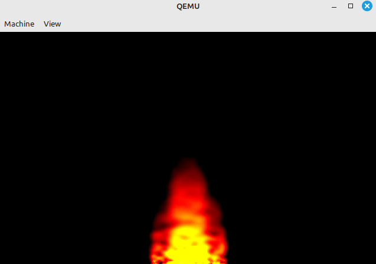

# X86 Boot Sector Flame Effect

A 512-byte x86 real-mode boot sector program that simulates an animated fire/flame
in VGA mode 13h (320×200, 256 colours), using the classic "spreading fire"
algorithm made famous by the Doom engine.





## Build & run

```bash
nasm -f bin -o flame.bin flame.asm
qemu-system-i386 -L /usr/local/share/qemu flame.bin

Where: -L is the path to the qemu bios dir

```

## How it works

### Colour palette
The 256-colour DAC is loaded with a linear fire gradient:

| index range | colour |
|-------------|--------|
| 0 – 63      | black -> red (`R = index`) |
| 64 – 127    | red -> yellow (`G` ramps up) |
| 128 – 191   | yellow (saturated) |
| 192 – 255   | yellow -> white (`B` ramps up) |

Each channel is computed analytically with saturating arithmetic — no lookup
table needed.

### Spreading fire algorithm
The VGA framebuffer (`A000:0000`) is used directly as the simulation buffer.
Each frame, every pixel at row *y* is updated from the row below it:

```
pixel[y][x] = ( pixel[y+1][x−1] + pixel[y+1][x]
              + pixel[y+1][x+1] + pixel[y+2][x] ) / 4  −  2
```

Processing rows **top-to-bottom** means each pixel reads from rows that
haven't been modified yet this frame, giving a clean single-buffer update.
The `−2` cooling term makes heat decay as it rises, so the flame fades
naturally before reaching the top of the screen.

### Bottom-row seeding (the fuel)
Row 199 (the bottom) is reseeded every frame with pseudo-random hot/cold
pixels to simulate burning fuel. A **16-bit Galois LFSR** (polynomial
`0xB400`, period 65 535) stored in register `BP` generates one independent
random bit per pixel — no stripes, no directional drift.

The seed zone is split into two rings centred on x = 160:

| zone | x range | hot probability | effect |
|------|---------|----------------|--------|
| outer ring | 128–143, 176–191 | 50 % | sparse base edges, fade lower |
| inner core | 144–175 | 87.5 % | dense heat, tall central spike |
| outside | 0–127, 192–319 | 0 % | always cold |

The inner core generates more sustained heat so it rises higher; the outer
ring fades earlier. This density difference naturally produces the tapered
flame shape — wide at the base, narrowing to a point at the top.

### Speed control
A simple nested delay loop runs between frames:

```asm
mov  bx, 140    ; ← tune this: higher = slower
.dly:
    xor  cx, cx
.dly2:
    loop .dly2  ; 65 536 inner iterations
    dec  bx
    jnz  .dly
```

Change `140` and rebuild to adjust animation speed.

### Memory layout

```
0x7C00  code (~220 bytes)
        [padding with zeros]
0x7DFE  0x55 0xAA  ← boot signature
```
